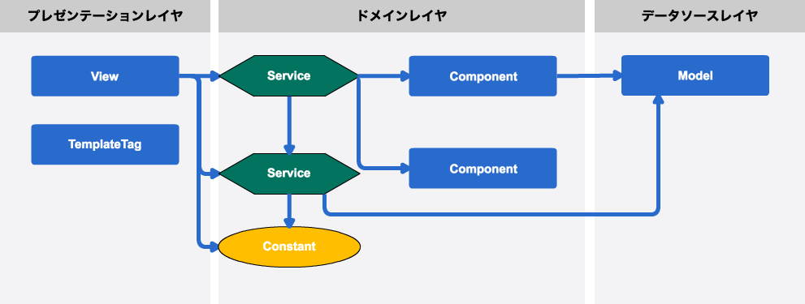

## あなたのそのPR、本当にリファクタリングって呼べますか？

コード改善 meetup #3 | 2017/06/29 | Masataka Arai

----

## お前誰よ？

* Masataka Arai [@massa142][1]
* [SQUEEZE Inc.][2]
* [Pythonもくもく会][3]
* PyCon JP スタッフ

[1]: http://massa142.github.io/
[2]: https://squeeze-inc.co.jp/
[3]: https://mokupy.connpass.com/

----

## 会社紹介

* 設立: 2014/09
* 社員数: 30名（外国籍: 10名）
* 事業: インバウンド、ホスピタリティ関連
    * 旅館・ホテル・民泊の空き部屋問題の解消
    * 地域活性化（地域コミュニティが持つ資産の活用）

[1]: https://squeeze-inc.co.jp/

-----

-----

----

## 入社してからコード改善の日々

* [SQUEEZE レガシーコード改善録 - PyCon mini Kumamoto 2017][1]
* [常にそこにいろ - Qiita][2]
* [Pythonistaが考えるLintの重要性 - Qiita][3]

[1]: https://massa142.github.io/pyconminikumamoto2017/#/
[2]: http://qiita.com/massa142/items/37b5cfd80daea5cac541
[3]: http://qiita.com/massa142/items/6639f9ecabcd84bbfe73

-----

<blockquote class="twitter-tweet" data-lang="ja">
gitで+ばかり増やしてる人は改善していない！やべえ。。 <a href="https://twitter.com/hashtag/code_kaizen?src=hash">#code_kaizen</a>
&mdash; ずきゅ～んたん (@ZuQ9Nn) <a href="https://twitter.com/ZuQ9Nn/status/796689749809299456">2016年11月10日</a></blockquote>

----

## 今日のお題

コード改善 x 設計

----

## そもそも

-----

## リファクタリングとは

> リファクタリングとは、ソフトウェアの外部的振る舞いを保ちつつ、理解や修正が簡単になるように、内部構造を改善することです。 また、リファクタリングは非常に統制された方法でコードを洗練していくため、バグの入り込む余地が少なくなっています。

出典: [リファクタリングとは何か？][1]

[1]: http://objectclub.jp/technicaldoc/refactoring/refact-what

-----

## 設計がよくないと

+ よくある例
  + それっぽい箇所にコピペ移植して終わり
  + どこかで見た/聞いたリファクタリングをとりあえず導入
+ 根本的な原因が解決されない
  + 近い将来また同じような書き直しが発生することに
+ 「内部構造を改善すること」という定義を満たしていない

-----

設計がなってないコード修正をリファクタリングって呼ぶな 😡

----

## 設計パターンの粒度

+ アーキテクチャパターン: 粒度大
+ デザインパターン: 粒度中
+ イディオム（プログラミングパターン）: 粒度小

=> 根本的な解決には粒度が大きいものから取り組む

-----

## アーキテクチャパターン

PofEAA(Patterns of Enterprise Application Architecture)

-----

## レイヤ化アーキテクチャのパターンカタログ

※ id: [asakichy さんのブログ][1]から引用(現在はプライベート設定)

[1]: http://d.hatena.ne.jp/asakichy/20110523/1306102859

----

## 昔のSQUEEZE

-----

## 😫😫😫

+ 依存関係が複雑すぎる
+ テストが書けない
+ 変更の影響範囲が広い
+ 責務の境界が不明瞭
+ Domain Layerが巨大なGODクラスに

-----

## 以下を参考に

+ [Active Record][1]
  + データと振る舞いの両方を持つ
+ [Service Layer][2]
  + アプリケーションの境界をサービス層を使って定義

[1]: http://bliki-ja.github.io/pofeaa/ActiveRecord/
[2]: http://bliki-ja.github.io/pofeaa/ServiceLayer/

-----

## チームで改善案を共有

-----

## 現在のSQUEEZE

----

## まとめ

-----

+ アーキテクチャに手をつけるのはめっちゃ大変
+ けど根本的な問題から目を逸らさないのが大事
+ 設計が整えば、デザインパターンとかの粒度が大きくない変更の適用も捗る
+ 設計がなってないコード修正をリファクタリングって呼ばない

-----

あなたのそのPR、本当にリファクタリングって呼べますか？ 🤔

----

## 参考資料

+ [エンタープライズ アプリケーションアーキテクチャパターン][1]
+ [技術的負債と向き合う by Naoya Ito][2]

[1]: http://amzn.to/2tmuz9w
[2]: https://speakerdeck.com/naoya/ji-shu-de-fu-zhai-toxiang-kihe-u

